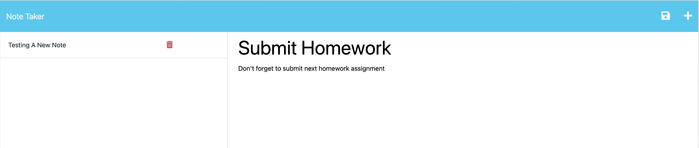

# jot_it
## Description 
A web app to jot down your notes in
## Installation 
clone down repo, then run `npm i` to install dev dependencies
## Usage 
[https://frozen-refuge-65524.herokuapp.com/](https://frozen-refuge-65524.herokuapp.com/)

## Credit 
[Starter code: Miniature Eureka](https://github.com/coding-boot-camp/miniature-eureka)
## License 
MIT License 

For more details, please refer to the LICENSE in the repo.
## Questions

 [Github : savannahvel](https://github.com/savannahvel)
